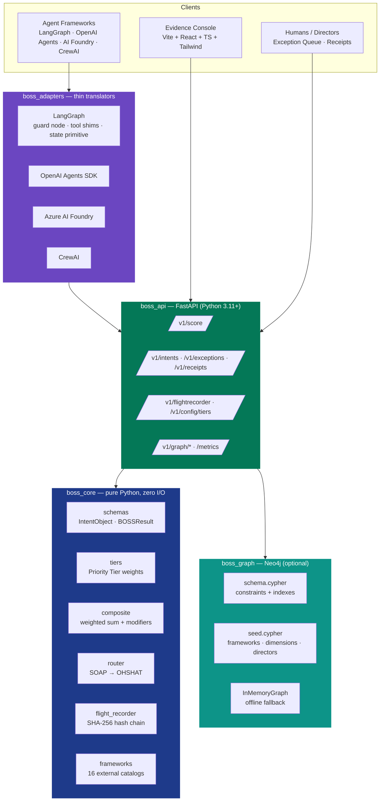

<p align="center">
  
</p>

<h1 align="center">BOSS — Business Operations Sovereignty Score</h1>

<p align="center">
  <em>The standalone scoring, routing, and evidence engine of the ADAM Autonomy Doctrine &amp; Architecture Model.</em>
</p>

<p align="center">
  <strong>One Intent. &nbsp; Seven Dimensions. &nbsp; One Composite. &nbsp; Evidence on the Chain.</strong>
</p>

<p align="center">
  
  
  
  
  
  <br>
  
  
  
  
  
  
</p>

<p align="center">
  Standalone implementation of the <strong>BOSS Formulas v3.2</strong> specified in the book
  <strong><em>"ADAM — Autonomy Doctrine &amp; Architecture Model"</em></strong> by Michael Lamb.<br>
  Use inside a full ADAM deployment, or as a drop-in governance substrate for <em>any</em> agent stack.
</p>

---

##  Stand-Alone, On Purpose

> Every agent framework ships planners, tools, memory, and traces.
> **Nobody ships a governance substrate.** BOSS is that substrate — and it ships as a small, deterministic Python package you can embed *anywhere*.

BOSS is the **scoring, routing, and evidence layer** of the ADAM reference architecture — extracted, packaged, and released independently so it can be adopted **without adopting all of ADAM**. It turns any agentic intent (a tool call, a plan step, a workflow action, a human-delegated task) into a single governance decision backed by a tamper-evident, hash-chained receipt.

<table>
<tr>
<th width="50%" align="center">✅ BOSS IS</th>
<th width="50%" align="center">❌ BOSS IS NOT</th>
</tr>
<tr>
<td valign="top">

- A **standalone Python package** (`pip install boss-engine`)
- A **REST service** (`POST /v1/score` returns 7 dimensions + composite + tier)
- A **pure-core + thin-adapter** architecture — `boss_core` imports nothing framework-specific
- A **tamper-evident evidence log** (SHA-256 hash chain, 7-year WORM)
- **Framework-agnostic** — LangGraph, OpenAI Agents SDK, AI Foundry, CrewAI, or none
- A **deterministic formula** anyone can reproduce: `C = Σ(S_d · W_d) / Σ W_d` with three explicit modifiers
- Deployable on **any conformant Kubernetes** — no operators, no CRDs

</td>
<td valign="top">

- Not an **agent runtime** — it adjudicates, it does not plan or act
- Not **coupled to ADAM** — the 5-Director Constitution and 81-Agent Mesh are *optional* upstream collaborators
- Not a **black box** — every score decomposes to sub-components with rationale and framework citations
- Not a **policy engine** — OPA/Rego lives upstream; BOSS consumes the verdict and anchors it in evidence
- Not a **bolt-on audit logger** — scoring and evidence are the same atomic operation
- Not a **replacement** for human directors — it *surfaces* exceptions, it does not approve them
- Not **opinionated** about your LLM, your vector store, or your tool-calling shape

</td>
</tr>
</table>

> **Why stand-alone matters.** The ADAM book describes a complete constitutional operating model. But many teams need *just the governance math and evidence* — without rewriting their agent stack. BOSS is the answer to that need: import the package, register an intent, get a verdict, keep a receipt.

---

##  By the Numbers

<p align="center">
  
  
  
  
  
  <br>
  
  
  75-Critical_Override-B91C1C?style=for-the-badge" alt="Critical Override">
  
  
</p>

| What You Get | Count |
|:---|:---:|
| Risk dimensions scored per intent | **7** |
| Escalation tiers (SOAP → OHSHAT) | **5** |
| External frameworks aligned out of the box | **16** |
| Priority Tier weights (Top 5.0 → Very Low 0.5) | **6 levels** |
| Composite modifiers (override · penalty · cap) | **3** |
| Agent adapters shipped (LangGraph deep + 3 thin) | **4** |
| Load-bearing test invariants | **8** |
| REST endpoints on the public API | **10+** |
| Canonical Cypher seeds (frameworks, dimensions, directors) | **dozens** |
| Flight Recorder evidence retention | **7 years** |

---

##  What BOSS Scores

Every intent is scored on **seven orthogonal risk dimensions**. Each dimension produces a `0–100` `raw_score`, decomposes into labelled sub-components with rationale, and cites the external frameworks it derives from.

| # | Dimension | What It Measures | Anchor Frameworks |
|:---:|:---|:---|:---|
| 1 | **Security** | Threat exposure, vulnerability posture, attack surface | NIST CSF 2.0 · CVSS 4.0 · MITRE ATT&CK · SEAL |
| 2 | **Sovereignty** | Data residency, jurisdictional control, supply-chain dependency | EU AI Act · DORA · NIS2 · national digital-sovereignty regimes |
| 3 | **Financial** | Monetary exposure, reversibility, FAIR loss distribution | FAIR · COSO ERM · director-specified thresholds |
| 4 | **Regulatory** | Regulation hit-rate and severity, certification status | EU AI Act · GDPR · DORA · NIS2 · ISO 31000 · NIST AI RMF |
| 5 | **Reputational** | Stakeholder trust impact, media surface, RepRisk/RepTrak signal | RepRisk · RepTrak · SASB |
| 6 | **Rights** | Human-rights impact, consent provenance, due-process integrity | UNGP · GDPR (data-subject rights) · ADAM Rights Ledger |
| 7 | **Doctrinal** | Alignment with the active ADAM doctrine + approved policy bundle | ADAM doctrine versioning · ISO/IEC 42001 |

---

##  One Number, Fully Explained

BOSS does not hide its math. The composite is a weighted sum over Priority-Tier-derived weights, passed through three explicit modifiers, and capped at 100.

```
                Σ (S_d · W_d)
   C_raw    =  ───────────────
                   Σ W_d

   C_final  =  min( 100,  apply_penalty( apply_override( C_raw ) ) )
```

| Priority Tier | Weight | Rule |
|:---|:---:|:---|
| **Top** | **5.0** | Exactly one dimension permitted at this tier |
| Very High | 4.0 | |
| High | 3.0 | |
| Medium | 2.0 | |
| Low | 1.0 | |
| Very Low | 0.5 | |

**ADAM defaults (v3.2):** Security **Top**, Sovereignty & Financial **Very High**, Regulatory & Reputational & Rights **High**, Doctrinal **Medium** — total weight **24.0**.

### The Three Modifiers

| Modifier | Trigger | Effect |
|:---|:---|:---|
| **Critical Dimension Override** | Any dimension score > 75 | `C ≥ max_dimension_score − 10` — a critical dimension can always drag the composite upward |
| **Non-Idempotent Penalty** | `is_non_idempotent = true` on the intent | `+15` additive — irreversible actions are structurally more expensive |
| **Hard Cap** | `C > 100` after above | Clamp at 100 — the scale is sealed |

All three modifiers are **traceable**: every `BOSSResult` returns a `modifiers: list[CompositeModifier]` with the delta and a human-readable explanation.

---

##  SOAP → OHSHAT

The composite routes into one of **five escalation tiers**, each with a response SLA drawn from the ADAM Exception Economy.

| Tier | Composite Band | SLA | Meaning |
|:---|:---:|:---:|:---|
| 🟢 **SOAP** | **0 – 10** | — | **S**afe & **O**ptimum **A**utonomous **P**erformance. Execute. |
| 🟡 **MODERATE** | **11 – 30** | — | Constrained execution with enhanced logging. |
| 🟠 **ELEVATED** | **31 – 50** | **60 min** | Exception likely; Domain Governor review. |
| 🔴 **HIGH** | **51 – 75** | **4 hours** | Director approval required. |
| ⚫ **OHSHAT** | **76 – 100** | **15 min** | **O**perational **H**ell, **S**end **H**umans **A**ct **T**oday. CEO + all directors; safe-mode engaged. |

---

##  How BOSS Is Built



**The boundary that matters:** `boss_core` is *pure Python with zero framework imports*. You can vendor the package into an air-gapped system, call the composite function directly, and still produce a conformant `BOSSResult`. Everything above `boss_core` is optional scaffolding.

---

##  16 External Frameworks, Out of the Box

Each dimension scorer cites at least one external framework; most cite several. The canonical mapping lives in `boss_core/frameworks.py` and is seeded into the graph by `boss_graph/seed.cypher`.

| Security | Sovereignty / Regulatory | Financial / Operational | Rights / Reputation |
|:---|:---|:---|:---|
| NIST CSF 2.0 | EU AI Act | FAIR | RepRisk |
| CVSS 4.0 | GDPR | COSO ERM | RepTrak |
| MITRE ATT&CK | DORA | ISO 31000 | SASB |
| SEAL | NIS2 | NIST AI RMF | |
| | ISO/IEC 42001 | | |

Every `DimensionScore` returns a `frameworks: list[str]` with the keys that justify its findings, and every exception packet lists the regulations in scope.

---

##  Install However You Deploy

| Path | Command | When To Pick |
|:---|:---|:---|
| **Python package** | `pip install boss-engine` | Embed BOSS as a library inside an existing Python agent stack. |
| **Dev API (no Neo4j)** | `pip install boss-engine[test] && uvicorn boss_api.app:app --reload` | Local scoring demos with the in-memory graph fallback. |
| **Docker Compose** | `docker compose up -d` | Full stack (API + Neo4j + console) on a single host. |
| **Kubernetes (vanilla)** | `kubectl apply -k deploy/k8s` | Any conformant cluster — EKS · AKS · GKE · OpenShift · k3s/k3d · minikube. |
| **ADAM full deploy** | `dna apply --profile <your-dna>` | Consumed by the DNA Deployment Tool as part of the 81-Agent Mesh. |

### 30-second demo

```bash
pip install boss-engine[test]
uvicorn boss_api.app:app --reload --port 8080
# In another terminal:
curl -s http://localhost:8080/v1/score \
     -H 'content-type: application/json' \
     --data @tests/fixtures/amber_coast_intent.json | jq
```

Expected shape:

```json
{
  "composite_final": 42.6,
  "escalation_tier": "ELEVATED",
  "response_sla_minutes": 60,
  "modifiers": [],
  "flight_recorder_hash": "…",
  "result_id": "…"
}
```

### Full stack (Neo4j + API + console)

```bash
docker compose up -d          # Neo4j + API + console on port 8080 / 5173
make graph-seed               # seed 16 frameworks + 7 dimensions + directors
open http://localhost:5173    # evidence console
```

---

##  NetStreamX "Amber Coast"

The ADAM book uses a fictional streaming company, **NetStreamX**, as its running worked example. Its flagship EU launch — *Amber Coast* — scores in the **ELEVATED** band: composite ≈ 42, one HIGH regulatory finding, GDPR + EU AI Act + DORA in scope, full data-residency compliance.

This exact intent ships as [`tests/fixtures/amber_coast_intent.json`](tests/fixtures/amber_coast_intent.json) and is the assertion behind the load-bearing invariant `test_amber_coast_routes_to_elevated`. Break that test and the engine is no longer BOSS-compliant.

The book walks through two further worked examples: a SOAP-band cat-video recommendation and an OHSHAT-band content takedown. All three are reproducible from the fixtures in `tests/fixtures/`.

---

##  What Ships in This Package

```
ADAM - BOSS Governance and Scoring Engine - Stand Alone/
├── boss_core/                 # pure Python — schemas, tiers, composite, router, flight_recorder, frameworks
│   └── dimensions/            # per-dimension scorers (security, sovereignty, financial, …)
├── boss_api/                  # FastAPI service — routers, config, dependencies, middleware
├── boss_graph/                # Cypher schema + seed + loader + InMemoryGraph fallback + GraphQL view
├── boss_adapters/             # LangGraph (deep), OpenAI Agents, AI Foundry, CrewAI
├── boss_console/              # Vite + React + TS + Tailwind evidence UI (standalone + dev builds)
├── deploy/
│   ├── k8s/                   # vanilla Kubernetes manifests (no operators, no CRDs)
│   └── helm/                  # optional chart
├── docs/
│   └── boss-engine-reference-manual.docx   # self-contained v3.2 reference
├── examples/                  # runnable one-file integrations per framework
├── scripts/                   # ops helpers — seed, verify, migrate
├── tests/                     # pytest + hypothesis + schemathesis + fixtures
├── BOSS Engine - Reference Manual v3.2.docx  # same manual at project root
├── Dockerfile · docker-compose.yml · Makefile · pyproject.toml
├── LICENSE · NOTICE · SECURITY.md · CONTRIBUTING.md · CODE_OF_CONDUCT.md · CHANGELOG.md
└── README.md                  # you are here
```

---

##  Load-Bearing Invariants

```bash
# Fast unit + API tests — no network, no Neo4j
pytest -m "not integration and not schemathesis"

# Property-based tests
pytest tests/property

# OpenAPI fuzz (opt-in; requires a running API)
pytest -m schemathesis

# Full coverage across all packages
pytest --cov=boss_core --cov=boss_api --cov=boss_graph --cov=boss_adapters
```

The test suite encodes **eight load-bearing invariants** (see [`tests/TESTING.md`](tests/TESTING.md)). They include: exactly-one-Top enforcement, composite-formula reproducibility, Critical Dimension Override behaviour, Non-Idempotent Penalty ordering, hash-chain linkage, SLA-tier boundary correctness, the NetStreamX Amber Coast ELEVATED fixture, and adapter-roundtrip equivalence. Break any one of them and the engine is no longer BOSS-compliant.

---

##  Drop-In Governance

BOSS is built to slot *into* an existing agent stack — not to replace it. The adapter layer exposes a uniform `evaluate_payload()` function that every framework calls identically; under the hood each adapter normalises its native payload shape into a canonical `IntentObject` and hands back an `AdapterDecision` (`ALLOW` · `ALLOW_WITH_CONSTRAINTS` · `ESCALATE` · `DENY`).

| Framework | Depth | What You Import |
|:---|:---|:---|
| **LangGraph** | Deep — guard node, tool shims, graph state primitive | `from boss_adapters.langgraph import BossGuardNode` |
| **OpenAI Agents SDK** | Thin translator | `from boss_adapters.openai_agents import evaluate_payload` |
| **Azure AI Foundry** | Thin translator | `from boss_adapters.ai_foundry import evaluate_payload` |
| **CrewAI** | Thin translator | `from boss_adapters.crewai import evaluate_payload` |
| **Generic / your own** | Call the API | `POST /v1/score` with an `IntentObject` JSON body |

No adapter loads its framework at `boss_adapters` import time — every import is lazy, so you can depend on BOSS without pulling in every agent SDK on the planet.

---

##  Governing the Governor

BOSS is a governance substrate. A vulnerability in BOSS is, by construction, a vulnerability in the safety of every agent it adjudicates. We govern ourselves accordingly.

| Document | Purpose |
|:---|:---|
| [`SECURITY.md`](SECURITY.md) | Threat model, supported versions, coordinated disclosure, reporting contact |
| [`CONTRIBUTING.md`](CONTRIBUTING.md) | How to propose changes that respect the eight load-bearing invariants |
| [`CODE_OF_CONDUCT.md`](CODE_OF_CONDUCT.md) | Contributor Covenant, adapted for the ADAM project |
| [`CHANGELOG.md`](CHANGELOG.md) | Every BOSS-Formulas-version bump plus release notes |
| [`NOTICE`](NOTICE) | Apache 2.0 attribution + trademark notice + third-party components |
| [`LICENSE`](LICENSE) | Apache License, Version 2.0 |

Flight Recorder integrity is verifiable offline with `boss verify`: every event appends `event_hash = H(prior_hash ∥ payload ∥ signer ∥ timestamp)` and the chain is walkable from any event to the genesis entry.

---

##  Where BOSS Lives in the ADAM SpecPack

BOSS is one component of the larger ADAM SpecPack. The siblings are optional but complementary.

| Component | Role |
|:---|:---|
| [`../README.md`](../README.md) | **ADAM SpecPack** — the full constitutional operating model |
| [`../ADAM - AGT-Plugin - FULL AGT Implementation v1.1/`](../ADAM%20-%20AGT-Plugin%20-%20FULL%20AGT%20Implementation%20v1.1/) | Full 7-package Agent-Governance Toolkit runtime plugin |
| [`../ADAM - AGT LIGHT Plugin v1.1/`](../ADAM%20-%20AGT%20LIGHT%20Plugin%20v1.1/) | Minimal RGI-compliant runtime plugin |
| [`../ADAM - DNA Tool v1.1/`](../ADAM%20-%20DNA%20Tool%20v1.1/) | Conversational AI configurator — fills the 13-section company genome |
| [`../ADAM - DNA Deployment Tool v1.1/`](../ADAM%20-%20DNA%20Deployment%20Tool%20v1.1/) | Python CLI — DNA → Terraform · Bicep · CloudFormation · Helm · Kustomize |
| [`../ADAM Sovereignty Connector 1.1/`](../ADAM%20Sovereignty%20Connector%201.1/) | Windows single-exe that stands up ADAM on k3d from a DNA profile |

BOSS is the **only** component that can run meaningfully *outside* ADAM — because a scoring engine is useful to anyone with agents to govern, whether or not they want the rest of the doctrine.

---

##  License + Attribution

Apache License 2.0 — see [`LICENSE`](LICENSE) and [`NOTICE`](NOTICE).

The seven BOSS dimensions, the composite-scoring formula, the tier-weight table, the Critical Dimension Override, the Non-Idempotent Penalty, the 100-cap, and the Flight Recorder hash-chain design are specified in the book *"ADAM — Autonomy Doctrine & Architecture Model"* v1.6 and reproduced in [`docs/boss-engine-reference-manual.docx`](docs/boss-engine-reference-manual.docx).

> **Read the book.** The math is here. The *reasoning* — why these seven dimensions, why Priority Tiers instead of free-form weights, why a +15 penalty rather than a multiplier, why SOAP → OHSHAT — is in the book. Available on Amazon and major book retailers.

<p align="center">
  <a href="https://www.amazon.com/"></a>
</p>
