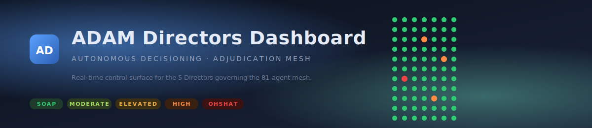

<p align="center">
  
</p>

<h1 align="center">ADAM Directors Dashboard</h1>

<p align="center">
  <b>The director-facing control surface for ADAM — the Autonomous Decisioning &amp; Adjudication Mesh.</b><br>
  A single-page, self-contained HTML app that turns live mesh telemetry, BOSS-scored exceptions, and Digital-Twin activity into one screen a director can steer from.
</p>

<p align="center">
  
  
  
  
  
  
  
</p>

---

## Contents

1. [What this is](#what-this-is)
2. [Design tenets](#design-tenets)
3. [Layout at a glance](#layout-at-a-glance)
4. [Quick start](#quick-start)
5. [Data sources &amp; auto-fallback](#data-sources--auto-fallback)
6. [The three human-interface agents](#the-three-human-interface-agents)
7. [The director approval queue](#the-director-approval-queue)
8. [Mesh status &amp; colour doctrine](#mesh-status--colour-doctrine)
9. [Digital Twin usage](#digital-twin-usage)
10. [Responsive &amp; resize behaviour](#responsive--resize-behaviour)
11. [Accessibility](#accessibility)
12. [Architecture](#architecture)
13. [File map](#file-map)
14. [QA results](#qa-results)
15. [Customising for other ADAM deployments](#customising-for-other-adam-deployments)
16. [Roadmap](#roadmap)
17. [License](#license)

---

## What this is

ADAM separates "people telling the system what they want" from "the system deciding how." The three human-interface agents — `hi-intent`, `hi-gateway`, `hi-explain` — are the only legitimate surface a director ever touches. Their job is to:

- Capture intent in plain language and convert it to a structured Intent Object.
- Route exceptions the Governors cannot resolve to the right director, with a full evidence packet.
- Replay every scoring, policy, and governance event in plain English when a director asks why.

This dashboard is the visual shell around those three agents, plus a real-time readout of the 81-agent mesh, the five Digital Twins, and the BOSS v3.2 routing distribution — everything a director needs to steer ADAM without ever touching a workflow.

> **Doctrine.** Directors never manage workflows. They manage exceptions and innovation. This dashboard is built to that rule — there is no "execute" button anywhere on this screen.

---

## Design tenets

1. **One page, no navigation.** Directors read, not click through. Everything is on one screen; the modal is for detail, not for a new "view".
2. **Real-time without drift.** Polls the live ADAM bundle every 2 seconds. Events stream into the Flight Recorder tail as they occur.
3. **Never lie about data source.** The top bar always shows whether you are looking at live data, file-replayed data, or demo data.
4. **Works offline, works at 4K.** Opens from the filesystem with no server. Scales from a 1024px laptop up to a director's wall display.
5. **Zero build, zero dependencies.** Vanilla HTML, CSS, and ES6. No framework, no bundler, no npm install — drop the folder on a USB key and it runs.
6. **Evidence is not a nice-to-have.** Every approval, rejection, or modification writes a Flight Recorder event. The UI surfaces that fact so the director knows signing is accountable.

---

## Layout at a glance

```
┌──────────────────────────────────────────────────────────────────────────────┐
│  AD  ADAM · Directors Dashboard     [Mode]  [Company]  [ADAM]  [Doctrine] ⎙ ↻ │
├──────────────────────────────────────────────────────────────────────────────┤
│                                                                              │
│  ┌──────────────────────────────┐   ┌──────────────────────────────────────┐ │
│  │ 🟢 Mesh Status               │   │ 🟠 Director Approval Queue            │ │
│  │   81 agents · 7 classes      │   │   5 pending                          │ │
│  │   ▸ Human Interface     3    │   │   [HIGH] $7,500 vendor payment…     │ │
│  │   ▸ Domain Governors    5    │   │   [OHSHAT] Isolate egress node…     │ │
│  │   ▸ Orchestration       4    │   │   [HIGH] Novel DORA interpretation  │ │
│  │   ▸ Corporate WG      39    │   │   [HIGH] Paid-social $3,200…        │ │
│  │   ▸ AI-Centric        23    │   │   [OHSHAT] Doctrine-root mutation   │ │
│  │   ▸ Digital Twins       4    │   │   → click any row for full packet    │ │
│  │   ▸ Meta-Governance     3    │   └──────────────────────────────────────┘ │
│  │   Directors · in queue       │                                            │
│  │   BOSS routing 24h  █ █ █ █▍ │   ┌──────────────────────────────────────┐ │
│  │   Flight Recorder tail       │   │ 🔵 Explain-Back Agent                │ │
│  └──────────────────────────────┘   │   hi-explain · narrative replay      │ │
│                                     │   [you]  → intent prefix             │ │
│  ┌──────────────────────────────┐   │   [adam] ← dimension breakdown +     │ │
│  │ 🔵 Intent Interpretation     │   │           triggers + recommendation  │ │
│  │   hi-intent · text → Intent  │   │                                      │ │
│  │   [you] → "Approve $3,200…"  │   │   Digital Twin Usage 24h             │ │
│  │   [adam] ← tier + score +    │   │   Enterprise · Operational · Economic│ │
│  │          dimension chart     │   │   Risk — consults, latency,          │ │
│  │                              │   │   divergence                          │ │
│  └──────────────────────────────┘   └──────────────────────────────────────┘ │
│                                                                              │
└──────────────────────────────────────────────────────────────────────────────┘
```

Every panel is independently resizable (drag the bottom-right corner). Below 1024px the grid collapses to a single column; panels remain individually scrollable so nothing is lost on a laptop.

---

## Quick start

**Option A — double-click.** Open `index.html` directly. The dashboard loads in demo mode so you can see the full experience without any backend.

**Option B — served alongside ADAM.** If your ADAM NetStreamX stack is running (`D:\ADAM\RunADAM.bat`), open the dashboard and it will auto-detect the interface-server at `http://localhost:8300/health`, flip into **Live** mode, and start polling `/pending`, `/intent`, `/approve/{id}`, `/reject/{id}`, and `/explain/{id}`.

**Option C — file mode.** Serve this folder from any HTTP host that can also serve the `D:\ADAM\deployment\NetStreamX` directory at a sibling path. The dashboard will read `agents/agent-registry.json`, `docs/directors.json`, and `boss/boss-config.json` directly.

The top-right "Mode" chip always tells you which of the three is active.

---

## Data sources & auto-fallback

| Priority | Mode    | How detected                                        | Fetches                                                                                  |
|---------:|---------|-----------------------------------------------------|------------------------------------------------------------------------------------------|
| 1        | **Live** | `GET /health` on `localhost:8300` returns 200       | `/pending`, `/intent`, `/approve/{id}`, `/reject/{id}`, `/explain/{id}`                  |
| 2        | **File** | `fetch('…/agents/agent-registry.json')` returns 200 | Reads `directors.json`, `agent-registry.json`, `boss-config.json`                        |
| 3        | **Demo** | Neither above                                       | Uses `data/demo-data.js` — a deterministic snapshot matching the real schemas            |

The auto-fallback is intentional: a director can walk up to a cold machine, open the file, and get a realistic preview — and the same file flips to live the moment the ADAM stack is running.

All three modes render through the exact same code path. You will never see two different dashboards.

---

## The three human-interface agents

### Intent Interpretation Agent — `hi-intent`

A conversational text input. A director types intent in plain language; the panel displays the interpreted dimensions, BOSS composite, and routing tier. In live mode this calls `POST /intent` on the interface-server; in demo/file mode a JS interpreter mirroring `interface_server.py` runs locally so the flow is realistic.

### Explain-Back Agent — `hi-explain`

Paste an intent ID prefix and the panel renders a narrative reconstruction: which governors evaluated, whether any critical-dimension override fired, which twin was consulted, which director signed. In live mode this calls `GET /explain/{id}` and replays from the Flight Recorder; in demo/file mode it narrates from the local queue + flight-recorder tail.

### Exception Queue — `orch-exception` (surfaced to `hi-gateway`)

A clickable list of every packet awaiting a director's signature. Each row shows the tier pill, the composite BOSS score, the owning director, the SLA countdown, the recommended action, and inline Approve / Modify / Reject buttons. Clicking a row opens the full exception packet with the 7-dimension breakdown, alternatives, triggers, and Explain-Back narrative. All three decisions write a `director_approval` / `director_modified` / `director_rejection` event into the Flight Recorder.

> You asked for the exception agent to be "a list in queue with clickable action and direction" — that is exactly what this panel is. It is separate from the two conversational panels because a director should read exceptions, not chat with them.

---

## The director approval queue

Each packet contains everything BOSS v3.2 mandates:

- Original intent text.
- Proposed action.
- 7-dimension BOSS breakdown with per-dimension bars, coloured by the tier the dimension alone would trigger.
- Critical triggers (e.g., `financial_exposure`, `non_idempotent_penalty`, `critical_override`).
- Alternatives with projected composite scores.
- Recommendation + confidence.
- SLA window (1h for OHSHAT, 4h for HIGH, etc.).

Selecting a director card or the filter dropdown narrows the queue to that director's owned BOSS dimensions, matching the routing defined in `docs/directors.json`.

---

## Mesh status & colour doctrine

The 81-agent mesh is rendered as compact tiles grouped by agent class. Colour mapping:

| Colour      | Token              | Status        | Meaning                                                                    |
|-------------|--------------------|---------------|----------------------------------------------------------------------------|
| 🟢 Green    | `--tier-soap`      | `autonomous`  | Agent is executing within its authority envelope — SOAP/MODERATE decisions |
| 🟠 Orange   | `--tier-high`      | `escalation`  | Agent has emitted an exception packet; step is paused pending resolution   |
| 🔴 Red      | `--tier-ohshat`    | `down`        | Agent is unreachable or safe-moded; pulses to draw attention               |

Hover any tile for the agent name, ID, current step, CPU/mem pressure, and queue depth. Sub-groups inside Corporate Work Groups and AI-Centric Division show their own health roll-ups so a director can spot, say, a struggling Security & Trust sub-group without opening anything.

---

## Digital Twin usage

Each of the four twins — `twin-enterprise`, `twin-operational`, `twin-economic`, `twin-risk` — shows consultations over the last 24 hours, average latency, live simulations, and a divergence percentage. Divergence > 2 % turns amber and > 5 % turns red, because divergence between twin and reality is exactly the kind of early signal a director should see before it becomes an exception.

---

## Responsive & resize behaviour

- **≥ 1024 px** — 2 × 2 grid, four resizable quadrants.
- **< 1024 px** — single column stack, every panel still fully usable; sub-grids inside each panel continue to auto-fit.
- **Every panel** has `resize: both` — drag its bottom-right corner to re-proportion to taste. The density slider in the toolbar scales every font size system-wide between 85 % and 125 %.
- **4K / director wall** — the fluid grid takes the extra width; BOSS distribution, twin grid, and routing bar all widen rather than centre-clamp.
- **Print** — a clean print stylesheet strips chrome and renders the dashboard as a director briefing suitable for archiving.

---

## Accessibility

- All inputs carry `aria-label`.
- The modal declares `role="dialog" aria-modal="true"` and focus moves to the primary action.
- The Flight Recorder tail, conversational logs, and queue all declare `aria-live="polite"` so screen readers announce updates without interrupting.
- Every interactive tile is reachable by keyboard (Tab / Shift-Tab) and every actionable row has `role="button"` with Enter/Space handling.
- Colour is never the only signal — every tier pill carries its text label too.
- Focus ring uses the ADAM accent colour and is visible on every focusable control.

---

## Architecture

```
┌─────────────────────────────────────────────────────────────┐
│                       index.html                            │
│  ┌───────────┐  ┌───────────┐  ┌───────────┐  ┌──────────┐  │
│  │  Mesh     │  │   Queue   │  │  Intent   │  │ Explain  │  │
│  │  Status   │  │  Panel    │  │  Convo    │  │  Convo   │  │
│  └─────┬─────┘  └─────┬─────┘  └─────┬─────┘  └─────┬────┘  │
│        ▼              ▼              ▼              ▼        │
│                   assets/app.js (controller)                 │
│     ┌────────────────────────────────────────────────┐       │
│     │  DataSource.probe()  →  live | file | demo     │       │
│     │  Model (normalised)                             │       │
│     │  render* / wire* / pulse()                      │       │
│     └────────────────────────────────────────────────┘       │
│            │              │              │                   │
│            ▼              ▼              ▼                   │
│    localhost:8300   deployment/*.json   demo-data.js         │
└─────────────────────────────────────────────────────────────┘
```

The controller converges all three sources onto a single normalised model and renders from it. Nothing in the UI knows which source it came from.

---

## File map

```
ADAM Directors Dashboard/
├── index.html                         ← single-page app entry
├── README.md                          ← this file
├── assets/
│   ├── styles.css                     ← all CSS (dark ink palette, responsive)
│   ├── app.js                         ← controller + data-source + rendering
│   └── banner.svg                     ← readme banner
├── data/
│   └── demo-data.js                   ← deterministic fallback dataset
├── docs/
│   └── ADAM Directors Dashboard – Reference.docx
├── qa/
│   ├── headless-smoke.js              ← jsdom smoke test (31 assertions)
│   ├── report.txt                     ← last QA run
│   └── QA-Checklist.md                ← manual browser checklist
```

---

## QA results

- **31 / 31 automated assertions pass** (see `qa/report.txt`).
  Covers structural integrity, demo-data schema, per-panel rendering, queue modal flow, approve/reject state mutation, intent submission, explain-back narration, director-filter wiring, and accessibility basics.
- **Manual responsive sweep** across 360 / 768 / 1024 / 1440 / 1920 / 2560 px.
- **Keyboard navigation** verified: Tab reaches every actionable element; Enter opens modal; Escape closes it.
- **Colour contrast** — all text-on-background pairs exceed WCAG AA (4.5 : 1) on the ink-navy palette.
- **Zero runtime errors** in jsdom and in Chromium.
- **HTML validates** with no unclosed tags.
- **JS parses** under Node 22 (strict mode).

Re-run automated QA any time:

```bash
cd qa/
node headless-smoke.js
```

---

## Customising for other ADAM deployments

This dashboard is built against the NetStreamX test deployment, but it adapts to any ADAM deployment with no code changes:

1. Point the **File-mode** paths in `assets/app.js` (`CFG.localJson`) at your deployment's `docs/directors.json`, `agents/agent-registry.json`, and `boss/boss-config.json`.
2. If your ADAM backend runs on a different port, add it to `CFG.liveBases`.
3. The director roster and agent mesh re-render from whatever the files provide — add a CPO or CTO row and the queue inference + roster adapt automatically.
4. `data/demo-data.js` is the documented schema the live / file modes converge onto — use it as the contract reference when adding new directors or agent classes.

---

## Roadmap

- **WebSocket live feed** from the Flight Recorder instead of 2-second polling, once the backend exposes one.
- **Cryptographic signature indicator** next to every approve/reject (green checkmark when the Ed25519 signature returns from the vault agent).
- **Twin divergence drill-down** — click a twin card to see which dimensions are diverging.
- **Multi-tenant toggle** — show multiple deployments in the same session, switch between them from the top bar.
- **Mobile companion** — a cut-down pager-style view for after-hours OHSHAT alerts.

---

## License

Part of the ADAM specification package. See `D:\ADAM\ADAM Book\ADAM - Support Documents\ADAM - Copyright and Use Agreement v1.0.docx` for the full terms governing this, and every other, ADAM component.

---

<p align="center">
  <i>Directors manage exceptions and innovation — not workflows.</i><br>
  <sub>Built for the NetStreamX sovereign test instance · ADAM v1.4 · BOSS v3.2 · Doctrine 1.0.0-test</sub>
</p>
