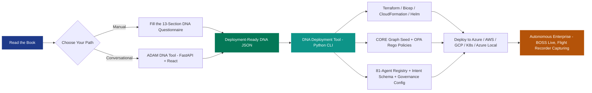
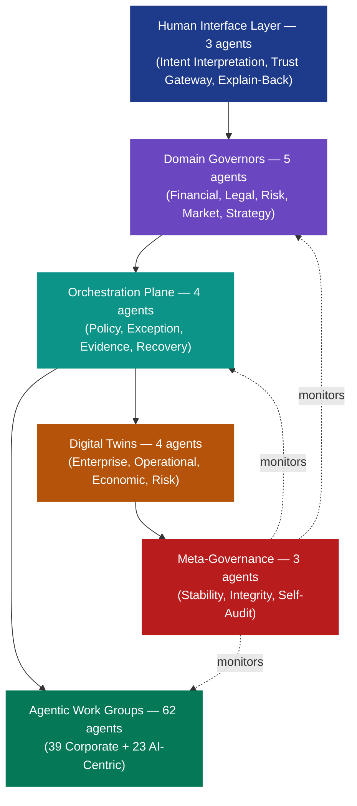

<p align="center">
  
</p>

<h1 align="center">ADAM — Autonomy Doctrine &amp; Architecture Model</h1>

<p align="center">
  <em>The only framework that delivers <strong>Doctrine + Architecture + Scoring + Tooling + Topology</strong> at scale.</em>
</p>

<p align="center">
  <strong>Humans Define Intent. &nbsp; Machines Execute. &nbsp; Evidence Proves Everything.</strong>
</p>

<p align="center">
  <a href="https://www.amazon.com/"></a>
  
  
  
  
  
  
</p>

<p align="center">
  Companion specification package to the book <strong><em>"ADAM — Autonomy Doctrine &amp; Architecture Model"</em></strong> by Michael Lamb.<br>
  <strong>Available on Amazon</strong> and major book retailers.
</p>

---

##  The Governance Gap Is Widening

> The problem isn't whether AI *can* act. It's whether anyone can prove *why* it did, *what* it was allowed to do, and *who* is on the hook when it goes wrong.

<p align="center">
  
  
  
  
  <br>
  
  
  
  
</p>

<table>
<tr>
<td width="50%" valign="top">

### What Is Happening
- **72%** of Global 2000 companies run agentic AI beyond pilot *(Q4 2025)*
- **85%** have deployed agents in at least one production workflow
- **71%** of enterprises lack formal AI governance *(Forrester 2026)*
- EU AI Act enforcement begins **August 2026**
- Gartner projects **40%** of agentic AI projects launched by 2027 will be cancelled

</td>
<td width="50%" valign="top">

### What Is Not
- Only **20%** have mature governance models
- **80%** lack monitoring and auditability infrastructure
- **1 in 3** have **zero** audit logs for autonomous systems
- Only **6%** of companies fully trust their AI *(HBR)*
- Not because the technology failed — because *no one could govern it.*

</td>
</tr>
</table>

> **This is not a technology problem. It is a *doctrine* problem.**
> Capabilities arrived before control structures. ADAM fills that void.

---

##  What ADAM Actually Is

<p align="center">
  
</p>

ADAM is a **constitutional operating model** for autonomous enterprises — industry-agnostic, sovereign by design, and machine-deployable. It keeps accountability attached to identifiable humans while letting machines do the work machines should do.

<table>
<tr>
<th width="33%" align="center">Humans Define Intent</th>
<th width="33%" align="center">Machines Execute</th>
<th width="33%" align="center">Evidence Proves Everything</th>
</tr>
<tr>
<td align="center" valign="top">

5 to 7 accountable **Directors** set outcomes, constraints, and risk tolerance.

They **never** touch a workflow.

</td>
<td align="center" valign="top">

A mesh of **~81 purpose-built agents** turns intent into coordinated action under policy.

Deterministic orchestration. Policy enforcement. Recovery built-in.

</td>
<td align="center" valign="top">

Every decision produces **cryptographically anchored forensic evidence**.

Audit equals **playback**, not archaeology.

</td>
</tr>
</table>

---

##  ADAM at a Glance

<p align="center">
  
  
  
  
  
  <br>
  
  
  
  
  
  <br>
  
  
  
  
</p>

| What You Get | Count |
|:---|:---:|
| Reference agent mesh across 7 canonical classes | **~81** |
| BOSS Score dimensions — each framework-anchored | **7** |
| BOSS escalation tiers *(SOAP → OHSHAT)* | **5** |
| Accountable human directors (core + optional CPO/CTO) | **5 (+2)** |
| Industry & government frameworks ADAM aligns to | **14+** |
| Reference cloud & sovereign architecture diagrams (draw.io) | **9** |
| Supported deployment targets | **5** |
| DNA Questionnaire sections — the company genome | **13** |
| Core book parts + appendices | **15 + 9** |
| Runtime plugin packages (AGT Light + Full AGT) | **2** |
| Working tools (DNA CLI + DNA Tool + Sovereignty Connector) | **3** |
| Core ADAM specifications in this repo | **12+** |
| Flight Recorder evidence retention (WORM, hash-chained) | **7 years** |

---

##  Why You Need the Book

<p align="center">
  
</p>

This repository is the **ADAM SpecPack** — the complete, AI-ready set of documents, schemas, policies, configurations, diagrams, and working tools an organization (or an AI build agent) needs to design and deploy a working ADAM instance.

**The book itself — *"ADAM — Autonomy Doctrine & Architecture Model"* — is NOT in this repository.** It is the authoritative narrative, rationale, and doctrine text, and it is available for purchase on **Amazon** and other major book retailers.

> <strong>The SpecPack is deliberately inert without the book.</strong> The schemas, policies, and tools here are well-formed but <em>undefended</em> artifacts on their own. The book contains the reasoning — chapter-level rationale, worked-through governance arguments, and the complete explanatory text — that makes every artifact here defensible in front of a board, a regulator, or a court.
>
> <strong>15 Parts. 9 Appendices. 222 pages of doctrine, architecture, and worked examples — including the full NetStreamX scenario.</strong>

If you intend to actually deploy ADAM — for a real company, a real board, a real regulator — **the book is not optional.**

<p align="center">
  <a href="https://www.amazon.com/"></a>
</p>

---

##  From a Blank Page to a Running Autonomous Company



<p align="center"><strong>Two paths. Same end state.</strong> A customized, defensible, evidence-first autonomous enterprise with every decision backed by a BOSS score, every action recorded in the Flight Recorder, and every delegation attached to an identifiable human director.</p>

For a local, air-gapped, showcase deployment on a single Windows 11 host, the **ADAM Sovereignty Connector** (a single `.exe`) collapses the entire install → bootstrap → deploy sequence into a k3d cluster in minutes — driven by Claude or any LLM over the Model Context Protocol.

---

##  Governance You Can Show to a Regulator

**BOSS** — the **Business Operations Sovereignty Score** — is a seven-dimension, 0–100 composite risk score attached to every autonomous action. It is **the** defensibility mechanism: every dimension maps directly to a framework regulators and auditors already require.

> No proprietary black-boxes. No opinions. No vibes.

### Dimensions Anchored to Real Frameworks

| # | BOSS Dimension | Anchored To |
|:---:|:---|:---|
| 1 | **Sovereignty Action** | EU SEAL, Eurotechguide Sovereignty Index |
| 2 | **Security Impact** | NIST CSF, MITRE ATT&CK, OWASP Agentic AA01–AA10 |
| 3 | **Financial Exposure** | FAIR, COSO ERM |
| 4 | **Regulatory Impact** | EU AI Act, DORA, NIS2, CMMC 2.0 |
| 5 | **Reputational Risk** | RepTrak, SASB Materiality |
| 6 | **Rights & Contractual Certainty** | WIPO, Creative Commons |
| 7 | **Doctrinal Alignment** | ADAM CORE Graph Drift Detection |

### The 5-Tier Escalation Spectrum

<p align="center">
  
  
  
  
  
</p>

Composite scores route through five escalation tiers — **SOAP → MODERATE → ELEVATED → HIGH → OHSHAT** *(Operational Hell, Send Humans. Act Today!)* — with a **Critical-Dimension Override**, a **+15 non-idempotent action penalty**, and **per-company dimensional weights** configured through the DNA Questionnaire. BOSS v3.2 ships with a canonical weight-sum of 24.0 and full policy provenance embedded in every score.

> Every BOSS score is **replayable**. Every BOSS score carries the **policy trace** it was derived from. Every BOSS score is **explainable to a human in plain language**.

---

##  Autonomy Is the Default. Humans Are the Premium.

<p align="center">
  
</p>

For a century, enterprises assumed humans should approve everything by default and automate the exceptions. **ADAM flips it.**

> **Autonomy is the default. Human involvement is earned by consequence, not convention.**
>
> Directors manage **exceptions and innovation** — not workflows, and not routine approvals. Every proposed action arrives with a predicted cost, risk, impact, and reversibility estimate. Humans see only what the doctrine says they should see: **exceptions with real stakes.**

### What This Buys You

<table>
<tr>
<td width="50%" valign="top">

#### The Economics of Interruption Are Explicit
Every escalation has a cost. BOSS scores ensure the right size of human lands on the right class of decision. No more "CEO approves the office lunch order."

</td>
<td width="50%" valign="top">

#### Structured Exception Packets
Directors see the same format every time — context, options, predicted impact, recommended action, reversibility — so human decision-time compresses dramatically.

</td>
</tr>
<tr>
<td width="50%" valign="top">

#### Every Resolved Exception Feeds CORE
The doctrine **learns**. The autonomy boundary shifts. Humans never re-solve the same problem twice.

</td>
<td width="50%" valign="top">

#### No More "Human in the Loop" Theater
Humans are not rubber stamps. They are the **last line of judgment** on things that actually matter.

</td>
</tr>
</table>

The Exception Economy is what makes scale governable. It is the reason a company running ADAM can shrink its management layer without shrinking its accountability.

---

##  The ADAM Doctrine

Each of the following is a full chapter of the book, a specification document in this repo, and — where applicable — a working artifact in the SpecPack.

| # | Pillar | What It Does |
|:---:|:---|:---|
| 1 | **CORE Engine** *(Culture, Objectives, Rules, Expectations)* | The machine-readable DNA of a company. A versioned, testable, rollbackable semantic graph with subgraphs for Financials, Rights & Licensing, Customer & Reputation, Regulatory & Jurisdiction, and Strategy Drift. Teaches AI what "good" looks like **inside your company**. |
| 2 | **BOSS Score v3.2** | Seven-dimension, 0–100, framework-anchored risk score on every action. Drives routing and escalation. |
| 3 | **The Exception Economy** | Autonomy-first operating model. Directors manage exceptions and innovation only. |
| 4 | **The 81-Agent Mesh** | Reference topology of ~81 purpose-built single-responsibility agents across 7 canonical classes. |
| 5 | **The 5-Director Constitution** | CEO, CFO, Legal, Market, CISO *(plus optional CPO/CTO)*. Accountable natural persons. No middle management. |
| 6 | **Formal Intent Objects** | Structured, versioned, immutable JSON for every request into ADAM. Flows through a six-stage execution pipeline. |
| 7 | **The Flight Recorder** | Hash-chained, WORM, tamper-evident, cryptographically signed evidence of every decision. 7-year retention. Audit equals replay. |
| 8 | **Doctrine Conflict Arbitration** | Objective collisions, drift, and innovation constraints surface as governance events. Humans author resolution; doctrine never self-amends. |
| 9 | **Four Cross-Cutting Guardrail Planes** | Policy & Risk / Evidence & Audit / Security & Trust / Stability & Drift. Architectural — cannot be bypassed. |
| 10 | **Cryptographic Authorization Vault** | Built-in, open-source, HSM-backed authorization ledger. No blockchain. No DAO. No smart contracts. |
| 11 | **Runtime Governance Interface (RGI)** | Five-contract interface that lets any compliant runtime substitute for the reference implementation. |

<table>
<tr>
<td width="50%" valign="top" align="center">
  
  <br><strong>The Flight Recorder</strong><br>
  <em>Hash-chained, WORM, tamper-evident, 7-year retention. Every decision replayable.</em>
</td>
<td width="50%" valign="top" align="center">
  
  <br><strong>Cryptographic Authorization Vault</strong><br>
  <em>HSM-backed, open-source ledger. No blockchain. No DAO. No smart contracts.</em>
</td>
</tr>
</table>

---

##  Reference Topology

<p align="center">
  
</p>



<p align="center">
  <strong>3 + 5 + 4 + 39 + 23 + 4 + 3 = <ins>81</ins> agents across 7 canonical classes</strong>
</p>

**81 is the reference baseline, not a requirement.** A real deployment customizes count, scope, and structure to industry, size, doctrine, and risk posture — anywhere from around 81 to well over 100 agents are auto-created at deployment from the filled DNA profile. **All 5 Domain Governors must concur** before execution on material actions.

---

##  Compatible by Construction

ADAM was designed to be defensible *before* regulators arrived.

<p align="center">
  
  
  
  
  
  
  
  
  
  
  
  
  
  
  
  
</p>

| Framework | Coverage |
|:---|:---|
| **EU AI Act** *(enforcement Aug 2026)* | Technical & organizational measures, human oversight, monitoring, suspension capability |
| **DORA** | Documented, reviewable, auditable ICT risk governance |
| **NIS2** | Cybersecurity as a board-level obligation |
| **ISO/IEC 42001** | AI management system |
| **NIST CSF + AI RMF** | Security & AI risk management posture |
| **MITRE ATT&CK** | Threat taxonomy integration |
| **OWASP Agentic AA01–AA10** | Full posture mapping in the AGT Light plugin |
| **OECD AI Principles** | Accountability attached to human & organizational actors |
| **Council of Europe AI Framework** | Human rights, democracy, rule of law |
| **Singapore IMDA Model AI Governance** | APAC AI governance alignment |
| **EU SEAL / Eurotechguide Index** | Sovereignty classification |
| **FAIR + COSO ERM** | Financial risk quantification |
| **WIPO + Creative Commons** | IP rights & content licensing |
| **RepTrak + SASB Materiality** | Reputational & ESG-material risk |
| **CMMC 2.0** | US DoD supply-chain cyber maturity |

**14+ frameworks, every BOSS dimension traced back to at least one.** Auditors see instruments they already know. Regulators see coverage they already require.

---

##  Deployment Topologies

<p align="center">
  
</p>

ADAM is vendor-neutral, jurisdiction-aware, and data-sovereign. Pick the topology that matches your regulatory posture:

<p align="center">
  
  
  
  
  
  
</p>

| # | Topology | Primary Use Case |
|:---:|:---|:---|
| 1 | **Azure Primary** | Hyperscale Microsoft-aligned deployment |
| 2 | **AWS Primary** | Hyperscale AWS-aligned deployment |
| 3 | **GCP Primary** | Hyperscale Google-aligned deployment |
| 4 | **Open Source Kubernetes** | Any K8s cluster, no vendor lock-in |
| 5 | **Multi-Cloud: Azure Primary / AWS Standby** | Active-passive across hyperscalers |
| 6 | **Multi-Cloud: AWS Primary / Azure Standby** | Active-passive, reversed |
| 7 | **On-Prem: Azure Stack / Local** | Sovereign cloud with Azure compatibility |
| 8 | **On-Prem: AWS Outposts** | Sovereign cloud with AWS compatibility |
| 9 | **Fully Sovereign On-Prem** | Air-gap, no hyperscaler dependency |

All nine ship as editable `.drawio` diagrams. All five **target platforms** (Azure, AWS, GCP, K8s, Azure Local) are first-class outputs of the DNA Deployment Tool — **Terraform, Bicep, CloudFormation, Helm, and Kustomize** generated automatically from your DNA.

---

##  Three Tools. One Pipeline.

Three working, runnable tools ship in this repository. Each is a concrete bridge between doctrine and infrastructure.

<table>
<tr>
<th width="33%">🧬 ADAM DNA Deployment Tool</th>
<th width="33%">💬 ADAM DNA Tool</th>
<th width="33%">🛡️ ADAM Sovereignty Connector</th>
</tr>
<tr>
<td valign="top"><strong>Python CLI</strong><br><br>
Reads a filled DNA Questionnaire; emits deployment-ready IaC, CORE graph seed data, BOSS policies in OPA/Rego, agent registry, Intent Object schema, governance config, and a professional Word spec per platform.<br><br>
<strong>Stack:</strong> Python 3, python-docx, Jinja2
</td>
<td valign="top"><strong>Conversational Web App</strong><br><br>
Replaces the static questionnaire. Ingests your strategy, finance, HR, compliance, and org docs. The AI extracts what it can, asks what it cannot, validates against the ADAM schema in real time, and outputs deployment-ready DNA JSON.<br><br>
<strong>Stack:</strong> FastAPI + React/Vite + Tailwind + Docker Compose + Helm. Provider-agnostic: OpenAI, Anthropic, or Azure OpenAI.
</td>
<td valign="top"><strong>Windows <code>.exe</code> + MCP Server</strong><br><br>
Stands up a full ADAM skeleton — CORE, 5-Director Constitution, BOSS v3.2, Flight Recorder, 81-Agent Mesh — on a fresh Windows 11 host using k3d. Air-gap-friendly. Driven by Claude or any LLM over MCP, with an append-only audit log and human-approval gates.<br><br>
<strong>Stack:</strong> Python 3.12, pyinstaller, Docker Desktop, k3d, Helm, MCP
</td>
</tr>
</table>

### Plus Two Runtime Plugin Packages

- **AGT Light** — Lightweight integration with Microsoft's Agent Governance Toolkit. Agent OS Rego policy template, execution-ring assignments, SLO config, Exception Economy config, OWASP AA01–AA10 posture mapping, the RGI schema, the enriched Flight Recorder event schema, and the AGT agent trust profile schema.
- **Full AGT Integration** — Complete Microsoft AGT integration: policy engine, agent mesh, runtime, SRE, compliance, and marketplace configuration — plus trust-score, policy-contract, and evidence-record JSON schemas that bridge AGT outputs into ADAM's Flight Recorder and BOSS pipeline.

> AGT Light is the **current reference runtime** — it is not ADAM's architecture. Any compliant runtime can replace it via the **RGI** without changing a line of doctrine.

---

##  Why ADAM Is Different

| Capability | Traditional Automation | Current AI Governance Tools | **ADAM** |
|:---|:---:|:---:|:---:|
| Explains **why** a decision was made | ❌ | ⚠️ Partial (post-hoc) | ✅ **By construction** |
| Anchors risk scoring to published frameworks | ❌ | ⚠️ Rarely | ✅ **7 dims × 14+ frameworks** |
| Cryptographically tamper-evident decision trail | ❌ | ❌ | ✅ **Flight Recorder, WORM, 7 yrs** |
| Replayable audit with original policy context | ❌ | ❌ | ✅ **Audit = playback** |
| Explicit, scoped, revocable delegation per director | ❌ | ❌ | ✅ **5-Director Constitution** |
| Doctrine-driven, not procedure-driven | ❌ | ❌ | ✅ **CORE Engine is live code** |
| Exception-first, not approval-first | ❌ | ❌ | ✅ **Exception Economy** |
| Sovereign, vendor-neutral, air-gap-deployable | ⚠️ Rare | ❌ | ✅ **9 topologies** |
| EU AI Act / DORA / NIS2 / ISO 42001 ready | ⚠️ Manual | ⚠️ Partial | ✅ **By construction** |
| AI-ready specification (machine-readable end-to-end) | ❌ | ❌ | ✅ **The SpecPack IS the feed** |

---

##  The Audiences

<table>
<tr>
<td width="33%" valign="top">

### 🏛️ Executives, Directors & Boards

ADAM is a **governance operating model**. It gives you a defensible, evidence-first way to run an AI-heavy business without expanding headcount linearly with complexity, and without signing liability over to software.

</td>
<td width="33%" valign="top">

### 🏗️ Architects, Platform & Security Leads

ADAM is a **reference architecture** with real schemas, Rego policy templates, Terraform modules, and a deterministic Runtime Governance Interface. Every component maps to concrete services *(Cosmos DB Gremlin / Neptune, OPA, Azure Confidential Ledger, LangGraph, Service Bus, Azure Key Vault HSM)*.

</td>
<td width="33%" valign="top">

### 🤖 AI Build Teams

The SpecPack is a **machine feed**. An AI implementation assistant can ingest this repository end-to-end and produce a customized ADAM instance for a named company — no human parsing required.

</td>
</tr>
</table>

---

##  The SpecPack

<details>
<summary><strong>Click to expand the full tree</strong></summary>

```
ADAM/
  ADAM - Autonomy Doctrine and Architecture Model.pdf        (The Book: preview / reference copy)
  ADAM - The Story Deck.pptx                                 (Executive presentation)

  ADAM - Support Documents/                                  (12+ canonical specifications)
    ADAM - Agent Org Chart.docx                                (the 81-Agent Mesh)
    ADAM - BOSS Score Formulas v3.2.docx                       (the math behind BOSS)
    ADAM - DNA Questionnaire.docx                              (13 sections, NetStreamX sample answers)
    ADAM - DNA Deployment Specification.docx                   (the infra spec)
    ADAM - Governance Charter and Human Directorship.docx
    ADAM - Intent Object Definition.docx
    ADAM - Keyword Glossary and Complex Definitions.docx
    ADAM - Industry Specific Services and Architecture.docx
    ADAM - Legal and Arbitration Sections.docx
    ADAM - Appendix 9 - Comparative Landscape.docx
    ADAM - Copyright and Use Agreement.docx

  ADAM - Architecture Diagrams v2.0/                         (9 editable draw.io topologies)
    ADAM_Architecture_Azure_Primary_V2.0.drawio
    ADAM_Architecture_AWS_Primary_V2.0.drawio
    ADAM_Architecture_GCP_Primary_V2.0.drawio
    ADAM_Architecture_OpenSource_Kubernetes_V2.0.drawio
    ADAM_MultiCloud_Azure_Primary_AWS_Standby_v2.0.drawio
    ADAM_MultiCloud_AWS_Primary_Azure_Standby_V2.0.drawio
    ADAM_Architecture_OnPrem_Azure_Stack_V2.0.drawio
    ADAM_Architecture_OnPrem_AWS_Outposts_V2.0.drawio
    ADAM_Fully_Sovereign_OnPrem_V2.0.drawio

  ADAM - DNA Deployment Tool/                                (Python CLI)
    adam_dna_tool.py                                           (entry point)
    questionnaire_parser.py                                    (13-section ingest)
    generators/                                                (per-platform IaC emitters)
    templates/
    example-output-netstreamx/                                 (worked example, all 5 platforms)

  ADAM - DNA Tool v1.1/                                      (Conversational web app)
    backend/                                                   (FastAPI + AI provider abstraction)
    frontend/                                                  (React + Vite + Tailwind)
    k8s/                                                       (Helm chart)
    docker-compose.yaml

  ADAM - AGT LIGHT Plugin v1.1/                              (Reference runtime integration)
    schemas/  deployment/  config/  docs/

  ADAM - AGT-Plugin - FULL AGT Implementation v1.1/          (Full Microsoft AGT integration)
    schemas/  deployment/  config/  integration/  docs/

  ADAM Sovereignty Connector 1.1/                            (Windows air-gap deployer .exe)
    src/  build/  deploy/  tests/  docs/
```
</details>

---

##  Pick Your Path

<table>
<tr>
<th width="33%" align="center">Path A — Conversational<br><em>(Recommended)</em></th>
<th width="33%" align="center">Path B — Manual</th>
<th width="33%" align="center">Path C — Local Sovereign Demo</th>
</tr>
<tr>
<td valign="top">

1. **Read the book** *(Amazon)*
2. Stand up the **ADAM DNA Tool** *(`docker-compose up` or Helm)*
3. Upload your strategy, financials, compliance, HR, and org docs
4. Answer the targeted questions for what the AI could not infer
5. Export validated **DNA JSON**
6. Feed into the **DNA Deployment Tool**:<br>`python adam_dna_tool.py --input dna.json --platforms azure,aws,k8s`
7. Deploy the generated IaC

</td>
<td valign="top">

1. **Read the book** *(Amazon)*
2. Fill the **13-section DNA Questionnaire** with directors and domain experts
3. `python adam_dna_tool.py --input questionnaire.docx --platforms all`
4. Deploy the generated IaC

</td>
<td valign="top">

1. **Read the book** *(Amazon)*
2. Run the **ADAM Sovereignty Connector** *(`adam-sovereignty-connector.exe`)* on a Windows 11 host
3. Claude *(or any LLM)* deploys the full ADAM skeleton on k3d over MCP in minutes
4. Full ADAM skeleton ready for demo, training, or sandbox use

</td>
</tr>
</table>

---

##  Clarity Before Compliance

<table>
<tr>
<th width="50%" align="center">✅ ADAM IS</th>
<th width="50%" align="center">❌ ADAM IS NOT</th>
</tr>
<tr>
<td valign="top">

- A constitutional operating model for autonomous enterprises
- Delegated authority that is **explicit, scoped, revocable, auditable**
- **EU AI Act, DORA, NIS2, ISO/IEC 42001** compatible by design
- **Sovereign, vendor-neutral, product-agnostic**
- **Evidence-first** by construction
- Industry-agnostic and adaptive per company DNA
- A doctrine you can show a **board, a regulator, and a court**

</td>
<td valign="top">

- A legal person or legal entity
- A liability shield or regulatory bypass
- A DAO or blockchain governance scheme
- A chatbot framework or LLM wrapper
- A replacement for human accountability
- Self-amending without human approval
- Immune to the regulations that apply to the organization running it

</td>
</tr>
</table>

---

##  In One Paragraph

> Modern enterprises have outgrown human coordination capacity. Automation solved repetition. ADAM solves the next layer: **governed autonomy** — the explicit, scoped, revocable, and auditable delegation of decision-making authority from humans to machines. Autonomy is not abdication. Directors define intent, constraints, and risk tolerance. Machines execute within doctrine. Every decision produces cryptographically anchored evidence *by construction*. Audit becomes playback, not archaeology. ADAM is not a chatbot, not a DAO, not a legal person, not a liability shield, and not a bypass of regulation. **It is a constitutional operating model that keeps accountability attached to identifiable humans while letting machines do the work machines should do.**

---

## License & Use

Use of the ADAM framework, doctrine, and SpecPack is governed by `ADAM - Support Documents/ADAM - Copyright and Use Agreement v1.0.docx` in this repository. Please read it before incorporating ADAM into a product, service, or commercial offering.

> ADAM is **not licensed** for use in defense, weaponry/drone industries, or in any system that monitors humans without their permission.

---

<p align="center">
  
</p>

<h2 align="center">Get the Book</h2>

<p align="center">
  <strong>ADAM — Autonomy Doctrine &amp; Architecture Model</strong><br>
  <em>By Michael Lamb</em><br>
  <strong>Available on Amazon and major book retailers.</strong>
</p>

<p align="center">
  <a href="https://www.amazon.com/"></a>
  <a href="https://github.com/Hercamo/ADAM"></a>
</p>

<p align="center"><em>The SpecPack in this repository is comprehensive for machine consumption. The book is what turns it into a coherent, defensible, implementable program.</em></p>

---

<p align="center">
  <strong>ADAM — Autonomy Doctrine &amp; Architecture Model</strong> &nbsp;—&nbsp; <em>The ADAM SpecPack</em> &nbsp;—&nbsp; © 2025–2026 Michael Lamb
</p>

<p align="center">
  <strong><em>Humans Define Intent. &nbsp; Machines Execute. &nbsp; Evidence Proves Everything.</em></strong>
</p>
